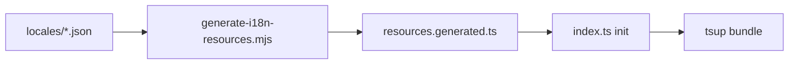

# Automate locale index registration

## Current state (main)

Audited on `main` with a clean working tree (Jul 2026). Assumptions below still hold; approach unchanged.

- **Registration:** `[packages/ui/src/i18n/index.ts](packages/ui/src/i18n/index.ts)` uses hand-written static imports for `en`, `fr`, `es` only.
- **Locale files:** `[packages/ui/src/i18n/locales/](packages/ui/src/i18n/locales/)` contains `en.json`, `fr.json`, `es.json`.
- **Hardcoded lists:** `[scripts/check-i18n-parity.mjs](scripts/check-i18n-parity.mjs)` has `TRANSLATION_LOCALES = ['fr', 'es']`; `[packages/ui/src/i18n/index.test.ts](packages/ui/src/i18n/index.test.ts)` hardcodes `supportedLngs`.
- **Codegen:** No `generate-i18n-resources` script and no `resources.generated.ts` in the repo.
- **CI:** Locale-ownership gate (`check-locale-ownership.test.sh` + CI self-test) and `check:i18n` parity only. No localization-changeset job.
- **Locale ownership (ADR 0003):** Author-only bypass for `platform-localization-pr-bot[bot]`. `index.ts` and future `resources.generated.ts` live outside `locales/**`, so the ownership gate does **not** block registration codegen — only JSON under `locales/` is gated.
- **Not on main (never committed; unrelated to this plan):** `check-localization-changeset.sh`, a localization-changeset CI job, and WIP CONTRIBUTING/PUBLISHING i18n sync edits from the earlier `localization_protection` branch audit. Do not assume or depend on those.

## Problem

New locale JSON can land via platform-localization sync PRs under `[packages/ui/src/i18n/locales/](packages/ui/src/i18n/locales/)`, but i18next only loads languages listed in `[packages/ui/src/i18n/index.ts](packages/ui/src/i18n/index.ts)` via hand-written static imports and a `resources` map. The same locale set is also hardcoded in `[packages/ui/src/i18n/index.test.ts](packages/ui/src/i18n/index.test.ts)` and `[scripts/check-i18n-parity.mjs](scripts/check-i18n-parity.mjs)`.

`import.meta.glob` is not viable: UI publishes via **tsup/esbuild**, which does not support Vite globs.

## Approach

Generate a small TypeScript module of static JSON imports from whatever `*.json` files exist in `locales/`. Keep i18next init logic hand-written. Always regenerate before UI build/test so a sync PR that only adds `de.json` still produces a bundle that includes `de`.

### Generated TypeScript in source (net-new pattern)

**Verdict:** Net-new for this repo — no existing `*.generated.ts` files or `generate`* scripts that emit committed TypeScript source.

**Closest analogues:**

- `**dist/` build output** — generated artifacts consumed at publish time, not checked in as source
- **tsup `define` injection** — build-time constants embedded into the bundle (e.g. Tailwind CSS in `YouVersionProvider`), not a separate `.ts` module in `src/`

**Open decision (pending user preference):** This plan currently assumes **committing** `resources.generated.ts` (see §4) so IDE/types and PR review stay clear, with a CI drift check to keep it in sync. The alternative is **build-only emit** — run the generator before `build`/`test` but gitignore the output and treat `locales/*.json` as the sole source of truth (closer to the `dist/` model). Approach below is unchanged until the user picks one.

## Implementation

### 1. Codegen script

Add `[packages/ui/scripts/generate-i18n-resources.mjs](packages/ui/scripts/generate-i18n-resources.mjs)` (or `scripts/generate-i18n-resources.mjs` at repo root if you prefer shared tooling next to parity):

- `readdirSync` on `packages/ui/src/i18n/locales/*.json`
- Sort codes stably (`en` first, then alphabetical) so diffs are deterministic
- Emit `[packages/ui/src/i18n/resources.generated.ts](packages/ui/src/i18n/resources.generated.ts)` with:
  - one `import xx from './locales/xx.json'` per file
  - `export const resources = { ... } as const`
  - `export const supportedLngs = Object.keys(resources)` (or keep derivation in `index.ts`)
  - a header: `// AUTO-GENERATED by generate-i18n-resources.mjs — do not edit`

Require `en.json` to exist; fail loudly if missing (fallback language).

### 2. Slim down `index.ts`

Refactor `[packages/ui/src/i18n/index.ts](packages/ui/src/i18n/index.ts)` to import `resources` / `supportedLngs` from `./resources.generated` and re-export them. Leave init, `fallbackLng`, brand interpolation, and `syncBrowserLanguageFromNavigator` unchanged.

### 3. Wire into package scripts

In `[packages/ui/package.json](packages/ui/package.json)`:

- `"generate:i18n": "node scripts/generate-i18n-resources.mjs"`
- Run it at the start of `"build"` (before `build:js`) and `"test"` (so Vitest sees current locales)

Add a root convenience script if useful, e.g. `"generate:i18n": "pnpm --filter @youversion/platform-react-ui generate:i18n"`.

### 4. Keep generated file committed + CI drift check

Commit `resources.generated.ts` so IDE/types and PR review stay clear.

Extend `[scripts/check-i18n-parity.mjs](scripts/check-i18n-parity.mjs)` (or a tiny sibling script invoked from `pnpm check:i18n`) to:

1. Run the generator (or spawn it)
2. Fail if `git diff --exit-code` shows changes to `resources.generated.ts`

That forces sync PRs (and humans) to include the regenerated file when a new locale JSON is added. Document that maintainers can run `pnpm generate:i18n` locally; optional later follow-up is teaching platform-localization’s `distribute-react.yml` to run the same command so the bot commits it automatically.

### 5. Discover locales in parity checker

Replace hardcoded `TRANSLATION_LOCALES = ['fr', 'es']` in `[scripts/check-i18n-parity.mjs](scripts/check-i18n-parity.mjs)` with filesystem discovery: all `*.json` in `locales/` except `en.json`. Keep existing parity rules (en canonical, warn missing keys, hard-fail extras / interpolation mismatches).

### 6. Fix tests to stop hardcoding the locale list

In `[packages/ui/src/i18n/index.test.ts](packages/ui/src/i18n/index.test.ts)`:

- Import `supportedLngs` from `./index` (or `./resources.generated`) instead of `['en','fr','es']`
- Prefer table-driven cases over one hardcoded test per locale where practical
- Keep an explicit unsupported-language fallback case (e.g. `de-DE` → `en`) using a code **not** in `supportedLngs` (pick dynamically if needed)

### 7. Docs

On `main`, `[CONTRIBUTING.md](CONTRIBUTING.md)` and `[PUBLISHING.md](PUBLISHING.md)` currently have little or no i18n sync detail — **prefer updating `[docs/i18n-guidelines.md](docs/i18n-guidelines.md)`** with a short **Adding a new locale** section:

1. Upstream adds the language and sync lands `packages/ui/src/i18n/locales/{code}.json`
2. Run `pnpm generate:i18n` (or rely on CI drift check) so `resources.generated.ts` updates
3. No hand-edit of `index.ts`
4. Parity/tests pick up the new file automatically

Only touch CONTRIBUTING/PUBLISHING if they actually mention sync-PR contents (they do not today).

## Out of scope (optional follow-up)

- Changing external `platform-localization` `distribute-react.yml` to run `pnpm generate:i18n` on sync PRs. This repo’s build + CI drift check already closes the functional gap; upstream would only remove the one-line regenerate step from sync PR authors.
- `check-localization-changeset.sh`, a localization-changeset CI job, and CONTRIBUTING/PUBLISHING i18n sync wording from uncommitted `localization_protection` WIP — never landed on `main`.

## Success criteria

- Adding `packages/ui/src/i18n/locales/de.json` and running `pnpm generate:i18n` (or UI build) registers `de` in i18next with no `index.ts` edit
- `pnpm check:i18n` fails if generated resources lag locale files
- Parity and unit tests do not hardcode `fr`/`es` lists

